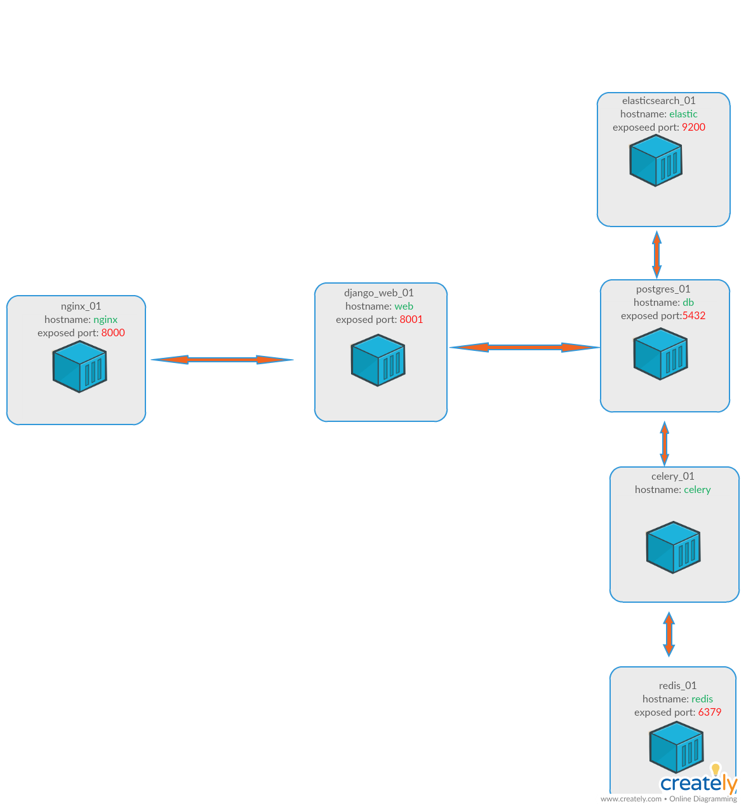
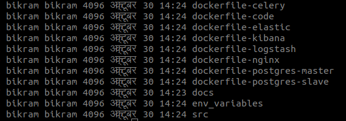
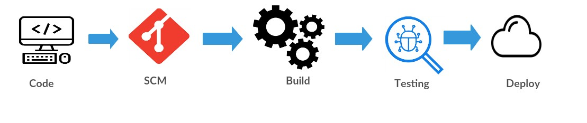

# Pustakalaya Project: Continous Integration and Deployment
E-Pustakalaya is an education-focused free and open digital library. It contains thousands of books, educational videos, audio-books, reference materials and interactive learning software.
E-Pustakalaya is accessible on the Internet fron [www.pustakalaya.org].
## Technology used:
**Development :** Python's Django Framework, Elatic search, Postgres, Celery, Rabbitmq
**Deployment:** Docker, Docker-swarm, Docker compose, gitlab-ci, Bash

## Archecture:
Pustakalaya is a digital library which is a repositiory for around 8000 pdf, videos and audios. It is developed in Python's Django framework and implements elaticsearch for the lighting search of the content.

We have implemented Docker ro containerise the deloyment. For development we have docker-compose method and for production we have docker-swarm mode. Docker swarm mode is easy method to deployment with minimum downtime and provisions easy rollback in case of failure.


### Containers
* nginx
* code (Django code)
* postgres-master
* postgres-slave(for backup only)
* elasticsearch
* celery
* rabbitmq


### Directory structure



All the dockerfiles are located a respective **dockerfile-[xxxx]**. Inside the docker
file-[CONTAINER] folder you may find two main files **Dockerfile.dev** and **Dockerfile.build**. **Dockerfile.dev** is used for development by developers while **Dockerfile.build** will used for production ie to create image  for final deployment. Apart from these two files you will also find repective container's  configuration files and script files and also the Dockerfile of each major relase tag (we will get to it later).

All the developer's code are located in **src** folder. Deveopers are encouraged not to tweak the Dockerfiles unless extremely necessary.

All the variables located in the the file **env_variables/code-variables.env**

*TO-DO* make sensitive variables encrypted and store all variables in the DJANGO project in single file.

### DevOps Pipeline



We have implemented gitlab-ci to continuously deploy and integrate code developed by developers. Please learn about gitlab-ci and yml structure before proceed.
Currently, we are using to branches to develop and deploy pustakalaya project, namely:
1. development (for developers)
2. production (for release and deployment)

Gitlab runs several runner to run the code. currently we have 2 of these,
1.  **202.63.240.131** (for dev.pustakalaya.org and pustakalaya.org hosted at subisu)
** dev.pustakalaya.org runs on the vagrant box whose port 81 is mapped to 8080 on the host machine and ehich is proxied by apache to run in domain dev.pustakalaya.org
2.  **192.168.5.231**  (mutable,local; to test production before live deploy)

## For Developers
Developers are required to use **development** branch for their development purpose. You will find docker compose file run.yml which is trimmed version of the development.yml where have removed the nginx conatiner and made it run solely on the gunicorn server provided by python. Please use your local machine for regular developemnt task. Please merge your branch with the **development** branch and push your commit to the remote repository

Our development server (dev.pustakalaya.org) is triggered once push your changes in development branch to git.olenepal.org. gitlab-ci to run this trigger is


```
stages:
  - clean
  - build
  - deploy-dev

prepare:clean:
  stage: clean
  script:
    - docker-compose -f development.yml down
  only:
    - development
  tags:
    - development

build:dev:
  stage: build
  script:
    - docker-compose -f development.yml build
  # when: manual
  only:
    - development
  tags:
    - development
# Push
# ----
# Pushes the Docker image to th registry for selected tags
deploy:dev.pustakalaya.org:
  stage: deploy-dev
  script:
    - sed -i "67s/.*/\<p\>$(date '+%Y-%m-%d %H:%M:%S')\<\/p\>/" src/templates/static_pages/about.html
    - docker-compose -f development.yml up  -d
  # when: manual
  only:
    - development
  tags:
    - development
```
Once you push your changes to development branch DevOps pipeline will trigger and will be shown as below:


click to each task to view details


NB: Notice the tag they are the identifir for the servers (gitlab runners) currently we have three runners like stated above:
* developent(for dev.pustakalaya.org)
* production (for pustakalaya.org)
* production-test (for testing production)

## Release Process

In order to release, after thorough testing in development system deveoper will merge their changes to the production branch (from development)
